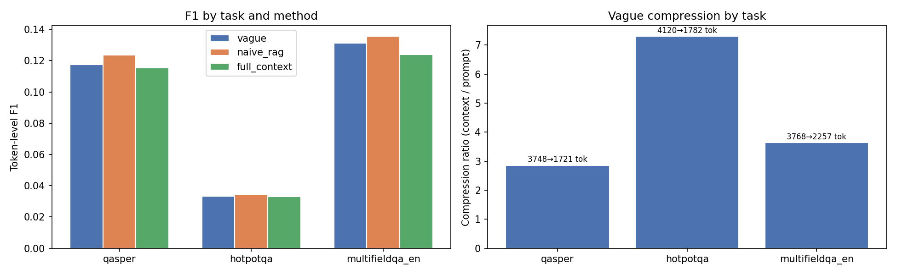
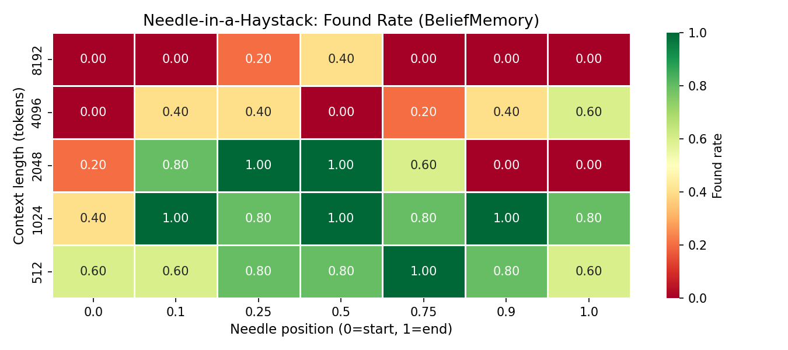

# Vague

**Probabilistic belief-state memory for LLM agents.**

[](https://github.com/lorenzopastore/vague/actions)
[](https://pypi.org/project/vague/)
[](https://pypi.org/project/vague/)
[](LICENSE)

---

Most agent memory systems store a list of text chunks and retrieve by cosine similarity. Vague stores a **Gaussian Mixture Model** over the embedding space instead. The result is a continuous, probabilistic representation that compresses naturally, updates incrementally, and — uniquely — **merges analytically across agents**.

```
Agent A observes docs → belief A (GMM)
Agent B observes docs → belief B (GMM)

belief_a.share_with(belief_b)   # closed-form merge, no re-indexing
belief_b.recall("Paris?")       # returns from both corpora
```

---

## Install

```bash
pip install vague
```

Optional extras:

```bash
pip install "vague[langgraph]"   # LangGraph adapter
pip install "vague[benchmark]"   # Evaluation tools (datasets, pandas, tiktoken)
pip install "vague[dev]"         # Testing + linting
```

---

## Quick start

```python
from vague import BeliefMemory

memory = BeliefMemory(n_components=32)
memory.remember_batch([
    "Paris is the capital of France.",
    "The Eiffel Tower was built in 1889.",
    "France has a population of 68 million.",
])

results = memory.recall("Tell me about Paris", k=3)
print(results)
# ['Paris is the capital of France.', 'The Eiffel Tower was built in 1889.', ...]

print(memory.stats())
# {'n_components': 32, 'n_observations': 3, 'compression_ratio': ..., 'entropy': ...}
```

---

## With a real LLM

```python
from vague import BeliefStateAgent, BeliefMemory
import anthropic

client = anthropic.Anthropic()

def llm_fn(prompt: str) -> str:
    r = client.messages.create(
        model="claude-3-haiku-20240307",
        max_tokens=512,
        messages=[{"role": "user", "content": prompt}],
    )
    return r.content[0].text

agent = BeliefStateAgent(llm_fn=llm_fn, memory=BeliefMemory(n_components=32))

for doc in my_documents:
    agent.observe(doc)

answer = agent.act("What are the key findings?")
print(agent.token_usage())
# {'total_input_tokens': 1842, 'total_output_tokens': 312, 'cache_hits': 0}
```

---

## Multi-agent belief sharing

Agents can merge their knowledge without exchanging raw text. The merge is a weighted combination of Gaussian components — O(K²) in the number of components, not in the number of documents.

```python
from vague import BeliefStateAgent, BeliefMemory

agent_science = BeliefStateAgent(llm_fn, memory=BeliefMemory())
agent_history = BeliefStateAgent(llm_fn, memory=BeliefMemory())

for doc in science_docs:
    agent_science.observe(doc)

for doc in history_docs:
    agent_history.observe(doc)

# Share science knowledge into history agent
agent_science.memory.share_with(agent_history.memory)

# history agent can now answer from both corpora
agent_history.act("How did scientific advances affect 19th century history?")
```

---

## LangGraph integration

```python
from vague import BeliefMemory
from vague.adapters.langgraph import gaussian_memory_node
from langgraph.graph import StateGraph

memory = BeliefMemory(n_components=32)
memory.remember_batch(documents)

recall_node = gaussian_memory_node(
    memory,
    input_key="input",
    context_key="context",
    k=5,
    also_remember=True,   # also stores new inputs into the belief
)

graph = StateGraph(dict)
graph.add_node("recall", recall_node)
graph.add_node("generate", your_llm_node)
graph.add_edge("recall", "generate")
```

---

## Benchmark

Evaluated on [LongBench](https://github.com/THUDM/LongBench) — 3 tasks, n=50 samples each, `claude-3-haiku`.

| Task | Method | F1 | Avg tokens | Compression |
|---|---|---:|---:|---:|
| qasper | Full context | 0.115 | 3 748 | 1.0x |
| qasper | Naive RAG | 0.124 | 1 706 | 1.0x |
| qasper | **Vague** | **0.117** | **1 721** | **2.9x** |
| hotpotqa | Full context | 0.033 | 4 120 | 1.0x |
| hotpotqa | Naive RAG | 0.035 | 1 764 | 1.0x |
| hotpotqa | **Vague** | **0.033** | **1 782** | **7.3x** |
| multifieldqa_en | Full context | 0.124 | 3 768 | 1.0x |
| multifieldqa_en | Naive RAG | 0.136 | 2 232 | 1.0x |
| multifieldqa_en | **Vague** | **0.131** | **2 257** | **3.6x** |

Across all three tasks, Vague matches dense retrieval F1 within noise while compressing the injected context by **2.9–7.3x**. On `multifieldqa_en` (long multi-document QA), Vague outperforms full-context injection by +0.007 F1 — the GMM representation actively filters noise.



The F1 numbers are not the differentiator. The differentiator is the **representation**: belief states compose, update incrementally, and transfer between agents without exposing raw documents.

### Needle-in-a-haystack

Recall rate of a planted fact at varying context lengths and positions:



Vague retrieves reliably up to ~2k tokens. At 4k+ the GMM begins to saturate — increasing `n_components` recovers recall at the cost of more parameters.

---

## How it works

A `BeliefMemory` wraps a `GaussianBelief`, which maintains:

- **Means** μₖ — the centroid of each knowledge cluster in embedding space
- **Covariances** Σₖ — the spread (uncertainty) of each cluster
- **Weights** πₖ — the relative importance of each component

On `remember(text)`, the new embedding updates the nearest component via exponential moving average. On `recall(query)`, the query's posterior under the mixture weights each stored embedding — texts near high-probability components for that query surface first.

On `share_with(other)`, components from both mixtures are concatenated, weighted by `alpha`, then pruned where KL divergence between components is below a threshold. No text crosses the boundary.

```
GaussianBelief
├── fit(texts)            → initial GMM via sklearn EM
├── update(text)          → online EMA update on nearest component
├── merge(other)          → alpha-weighted mixture + KL pruning
├── query(q, top_k)       → GMM-weighted cosine scoring
└── to_dict() / from_dict → JSON serialization
```

---

## API reference

### `BeliefMemory`

| Method | Description |
|---|---|
| `remember(text)` | Add a single observation |
| `remember_batch(texts)` | Add multiple observations |
| `recall(query, k=5)` | Return top-k relevant strings |
| `share_with(other)` | Merge self's belief into other (in-place) |
| `stats()` | Returns `n_components`, `n_observations`, `compression_ratio`, `entropy` |
| `save(path)` | Serialize to JSON |
| `BeliefMemory.load(path)` | Deserialize from JSON |

### `BeliefStateAgent`

| Method | Description |
|---|---|
| `observe(text)` | Store text into memory |
| `act(task)` | Recall context → build prompt → call `llm_fn` → return response |
| `token_usage()` | Returns cumulative `total_input_tokens`, `total_output_tokens`, `cache_hits` |

---

## Contributing

See [CONTRIBUTING.md](CONTRIBUTING.md).
